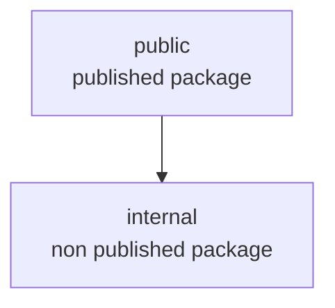

# nx-rollup doesn't bundle internal packages

When building a publishable library with rollup (or esbuild), it should be possible to
bundle non publishable libraries.

Note that I would also expect that I can a publishable project may depend on non buildable projects
when the publishable project uses a bundler.

```sh
npm install
npx nx build public
```

Notice that rollup can't resolve the internal-buildable lib and automatically treats it as external.

```sh
> nx run public:build

> rollup -c rollup.config.cjs


/Users/thdk/repos/thdk/nx/nx-rollup-internal-package/packages/public/src/index.ts → ../../dist/packages/public, ../../dist/packages/public...
  index.cjs.js 202 Bytes
  index.esm.js 162 Bytes
(!) Unresolved dependencies
https://rollupjs.org/troubleshooting/#warning-treating-module-as-external-dependency
@nx-rollup-internal-package/internal-buildable (imported by "src/lib/public.ts")
created ../../dist/packages/public, ../../dist/packages/public in 380ms
```

```js
// dist/packages/public/index.esm.js
import { internalBuildable } from '@nx-rollup-internal-package/internal-buildable'; // This should have been replaced with the actual code

function publicFn() {
  return internalBuildable();
}

export { publicFn };
```

## Projects Graph


