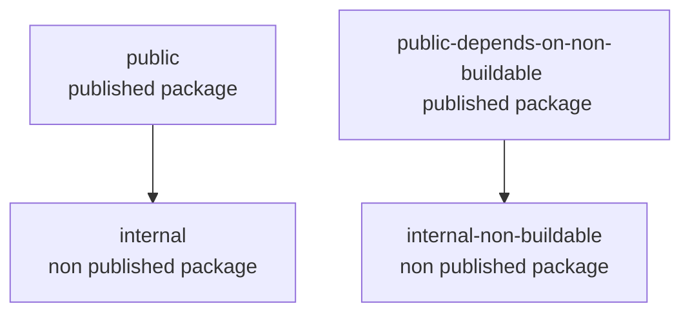

# nx-rollup doesn't bundle internal packages

When building a publishable library with rollup (or esbuild), it should be possible to
bundle non publishable libraries.

## Case A: Bundle publishable library that depends on internal buildable library

```sh
npx nx build public
```

Notice that rollup can't resolve the internal-buildable lib and automatically treats it as external.

```sh
> nx run public:build

> rollup -c rollup.config.cjs


/Users/thdk/repos/thdk/nx/nx-rollup-internal-package/packages/public/src/index.ts → ../../dist/packages/public, ../../dist/packages/public...
  index.cjs.js 202 Bytes
  index.esm.js 162 Bytes
(!) Unresolved dependencies
https://rollupjs.org/troubleshooting/#warning-treating-module-as-external-dependency
@nx-rollup-internal-package/internal-buildable (imported by "src/lib/public.ts")
created ../../dist/packages/public, ../../dist/packages/public in 380ms
```

```js
// dist/packages/public/index.esm.js
import { internalBuildable } from '@nx-rollup-internal-package/internal-buildable'; // This should have been replaced with the actual code

function publicFn() {
  return internalBuildable();
}

export { publicFn };
```

## Case B: Bundle publishable library that depends on internal non buildable library

```sh
npx nx build public-depends-on-non-buildable
```

```sh
> nx run public-depends-on-non-buildable:build

> rollup -c rollup.config.cjs


/Users/thdk/repos/thdk/nx/nx-rollup-internal-package/packages/public-depends-on-non-buildable/src/index.ts → ../../dist/packages/public-depends-on-non-buildable, ../../dist/packages/public-depends-on-non-buildable...
[!] (plugin rpt2) RollupError: [plugin rpt2] src/lib/public-depends-on-non-buildable.ts:2:38 - error TS6059: File '/Users/thdk/repos/thdk/nx/nx-rollup-internal-package/packages/internal-non-buildable/src/index.ts' is not under 'rootDir' '/Users/thdk/repos/thdk/nx/nx-rollup-internal-package/packages/public-depends-on-non-buildable'. 'rootDir' is expected to contain all source files.
  The file is in the program because:
    Imported via '@nx-rollup-internal-package/internal-non-buildable' from file '/Users/thdk/repos/thdk/nx/nx-rollup-internal-package/packages/public-depends-on-non-buildable/src/lib/public-depends-on-non-buildable.ts'
    Root file specified for compilation

2 import { internalNonBuildable } from '@nx-rollup-internal-package/internal-non-buildable';
                                       ~~~~~~~~~~~~~~~~~~~~~~~~~~~~~~~~~~~~~~~~~~~~~~~~~~~~

src/index.ts

    at getRollupError (/Users/thdk/repos/thdk/nx/nx-rollup-internal-package/node_modules/rollup/dist/shared/parseAst.js:285:41)
    at Object.error (/Users/thdk/repos/thdk/nx/nx-rollup-internal-package/node_modules/rollup/dist/shared/parseAst.js:281:42)
    at Object.error (/Users/thdk/repos/thdk/nx/nx-rollup-internal-package/node_modules/rollup/dist/shared/rollup.js:888:32)
    at RollupContext.error (/Users/thdk/repos/thdk/nx/nx-rollup-internal-package/node_modules/rollup-plugin-typescript2/src/context.ts:35:17)
    at /Users/thdk/repos/thdk/nx/nx-rollup-internal-package/node_modules/rollup-plugin-typescript2/src/diagnostics.ts:70:17
    at Array.forEach (<anonymous>)
    at printDiagnostics (/Users/thdk/repos/thdk/nx/nx-rollup-internal-package/node_modules/rollup-plugin-typescript2/src/diagnostics.ts:42:14)
    at typecheckFile (/Users/thdk/repos/thdk/nx/nx-rollup-internal-package/node_modules/rollup-plugin-typescript2/src/index.ts:67:3)
    at Object.<anonymous> (/Users/thdk/repos/thdk/nx/nx-rollup-internal-package/node_modules/rollup-plugin-typescript2/src/index.ts:269:5)
    at Generator.next (<anonymous>)


Warning: command "rollup -c rollup.config.cjs" exited with non-zero status code
```

## Projects Graph


